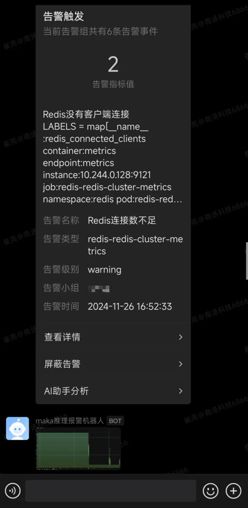
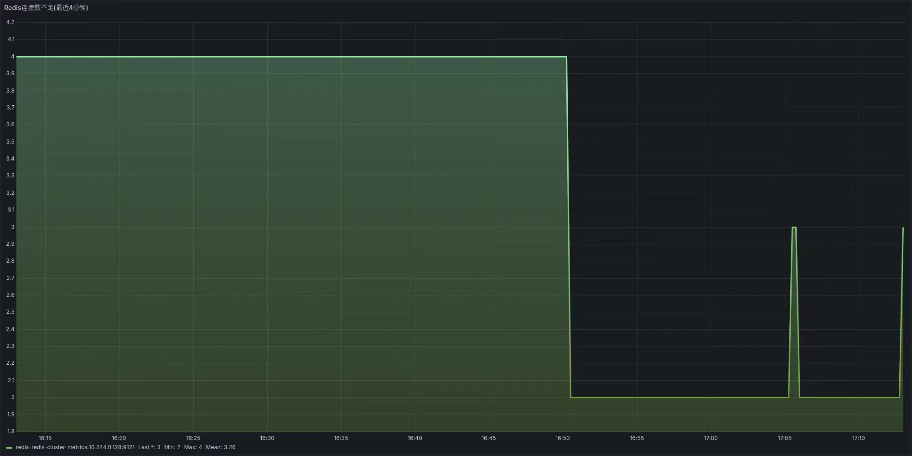
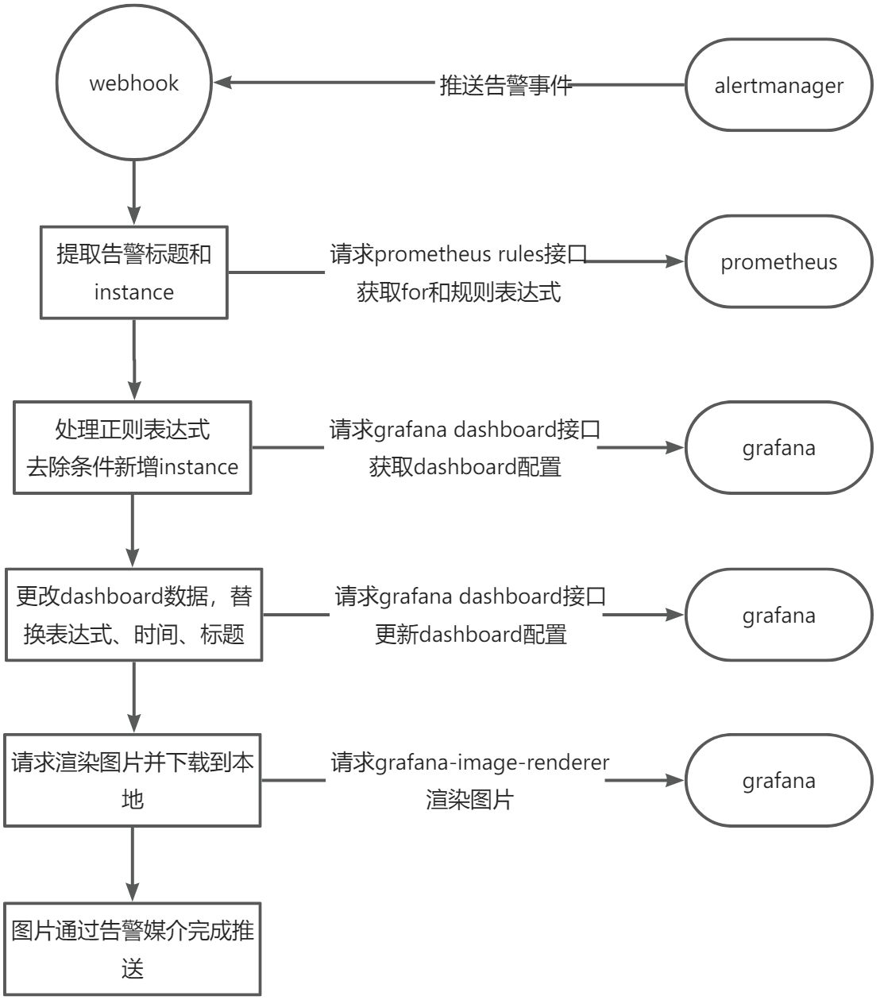
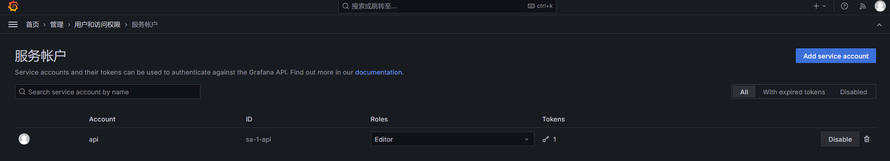
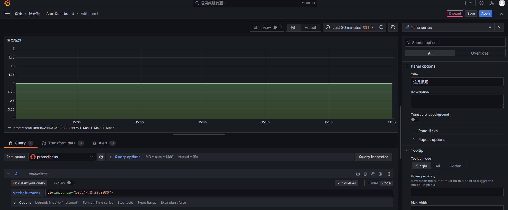
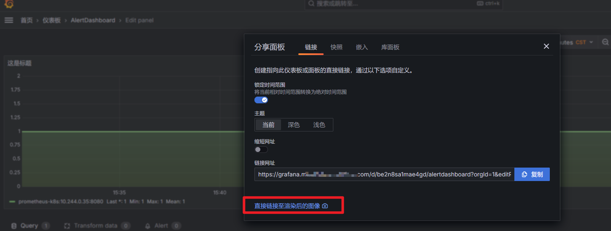

## 告警带图
### 需求背景

#### 告警分析处理流程

通常我们收到 Prometheus 告警事件通知后，往往都需要登录 Alertmanager 页面查看当前激活的告警，如果需要分析告警历史数据信息，还需要登录 Prometheus 页面的在 Alerts 中查询告警 promQL 表达式，然后复制到 Graph 中查询数据。

这样做无疑大大降低了故障分析和处理流程，此时有些聪明的小伙伴就在想，能不能在告警事件推送的时候，将这些历史数据绘制成图表一块推送过来，方便我们第一时间了解指标变化趋势，便于更快的处理问题。

#### 功能需求分析

    1.可靠性要求：无论告警图表数据是否能获取到，都不能影响告警信息的及时推送。（这是 webhook 最核心的功能，告警带图只是锦上添花，不可本末倒置，不能因为获取图表失败而导致告警事件无法正常推送。）
    2.数据折线图显示：希望可以查询指定时间范围内数据变化趋势，便于分析排查问题，这是最核心的功能。
    3.只显示异常 instance 数据：每个 job 都会对应很多 targets，我们只希望显示异常 instance 相关的数据，避免整个图表因数据过多导致显示混乱。
    4.最大值最小值最近值显示：这三个值是我们最关注的信息，尤其是最近值，在告警触发时还是告警恢复后，我们都需要知道这个指标当前值是多少。
    5.时间范围灵活：有些告警比较灵敏，for 时间会较短，通常不到 1 分钟（例如网络探针检测 http 状态码）。而有些告警比较迟钝，for 时间会设置的比较长，通常以为小时为单位（例如证书有效期监控）。而此时告警图表时间范围不应该统一设置为某个指定的值，而是根据 for 配置的时间灵活变化。
### 实现思路与效果
#### 实现效果
废话不多说，先展示一下最终的告警效果。

grafana 渲染指标图：

#### 方案对比分析
针对这个需求，目前主流的实现方案主要有以下两种。

方案 1：开发程序，查询 prometheus 指标数据，然后使用图表库渲染出图片，以 python 为例，可以使用 Matplotlib 或 Pandas 实现 。

优点：实现起来较为灵活，可以很好的满足各种功能需求。

缺点：图表样式单一，如果需要修改图表样式需要变更代码。

方案 2：使用 grafana-image-renderer插件渲染图片。

优点：图表样式美观，图表配置灵活方便。

缺点：需要指定 dashboard 和 panel 的 id 才能渲染，也就意味着每个告警规则都需要创建一个图表，工作量巨大。

#### 实现思路

既然两种方案都各有优缺点，能否将两种方案的优点整合起来，既要配置实现起来灵活方便又要图表样式美观且易于配置呢？毕竟只有小孩子才做选择题，大人都是全都要。

具体实现思路如下：

    1.收到 alertmanager 推送告警数据
    2.根据告警数据，提取告警标题和异常的 instance 。
    3.根据告警标题请求 prometheus 的 rules 接口 ，获取 for 和表达式配置。接口文档：<https://prometheus.ac.cn/docs/prometheus/latest/querying/api/#rules>
    4.正则处理表达式，去除条件判断值，并新增 instance 标签选择，例如原始的告警规则表达式为，处理后的查询语句为
    5.请求 grafana 的 api 接口，获取 grafana dashboard 配置。接口文档：<https://grafana.com/docs/grafana/latest/developers/http_api/dashboard/>
    6.根据获取到的 dashboard 配置数据，替换表达式，时间范围， 告警标题。
    7.再次 post 请求 grafana 的 api 接口，更新 dashboard 配置。
    8.调用grafana-image-renderer插件，传入 dashboard 和 panels 参数，渲染图片并下载到本地。
    9.将本地图片推送至企业微信、钉钉或 teams（也可上传至公有云对象存储，直接返回图片公网 url 地址）。
流程图如下：

### 核心代码与配置
grafana 配置
1.创建 api key 用于调用 api 接口请求 grafana。

2.创建 dashboard 和图表，并配置图表样式。

表达式、标题、时间范围可以随便写，主要是为了调试图表配置。

3.安装grafana-image-renderer 插件。
参考文档：<https://grafana.com/grafana/plugins/grafana-image-renderer/。安装完成后点击渲染图像验证是否可以正常渲染。>

#### webhook 程序
核心代码如下，需要注意的是为了确保可以正常获取图片和推送消息，建议添加重试和异常处理逻辑，增加程序可靠性。

import base64
import hashlib
import json
import re
import time
import os
import httpx
from log import logger
from config import vx_conf, grafana_conf, alertmanager_conf, prometheus_conf, aliyun_conf
from oss2 import Auth, Bucket, exceptions

class VxRobot:
    """
    企业微信推送
    """

    def __init__(self, team, max_retries=3, backoff_factor=2):
        self.url = vx_conf[team]
        self.headers = {'Content-Type': 'application/json'}
        self.params = {}
        self.max_retries = max_retries
        self.backoff_factor = backoff_factor

    def __send_data(self):
        """
        推送企业微信数据
        :return:
        """
        retries = 0
        with httpx.Client(verify=False) as client:
            while retries < self.max_retries:
                try:
                    # 发送 POST 请求
                    response = client.post(self.url, headers=self.headers, json=self.params, timeout=10)
                    response.raise_for_status()  # 如果状态码不是 2xx，会抛出异常
                    if response.json()['errcode'] == 0:
                        logger.info("企业微信告警推送完成")
                        return
                    else:
                        logger.error(f"企业微信告警推送内容有误: {response.json()['errmsg']}")
                        break
                except (httpx.RequestError, httpx.HTTPStatusError) as exc:
                    retries += 1
                    logger.error(f"企业微信告警推送失败 (尝试 {retries}/{self.max_retries}): {exc}")
                    if retries < self.max_retries:
                        sleep_time = self.backoff_factor * retries
                        logger.info(f"等待 {sleep_time} 秒后重试...")
                        time.sleep(sleep_time)  # 实现退避策略
                    else:
                        logger.error("达到最大重试次数，企业微信告警推送失败")
                        raise Exception(f"无法使用企业微信告警推送: {exc}")

    def send_img(self, image_path):
        """
        推送图片信息
        :param image_path:图片路径
        :return: None
        """
        try:
            # 读取图片文件内容
            with open(image_path, "rb") as f:
                image_data = f.read()
            # 计算图片内容的 MD5 值
            md5_hash = hashlib.md5(image_data).hexdigest()
            # 生成图片内容的 Base64 编码
            base64_encoded = base64.b64encode(image_data).decode("utf-8")
        except FileNotFoundError:
            raise FileNotFoundError(f"图片文件 {image_path} 未找到")
        except Exception as e:
            raise RuntimeError(f"处理图片时发生错误: {str(e)}")
        params = {
            "msgtype": "image",
            "image": {
                "base64": "DATA",
                "md5": "MD5"
            }
        }
        # 数据替换
        params["image"]["base64"] = base64_encoded
        params["image"]["md5"] = md5_hash
        logger.info("推送企业微信图片内容，图片地址为%s" % image_path)
        self.params = params
        self.__send_data()

def get_panel(alert_name, instance):
    """
    获取指标图表信息
    :return:
    """
    prometheus = PrometheusTools()
    config = prometheus.get_alert_config(alert_name)
    config['instance'] = instance
    config['time_range'] = 'now-' + str(2 *config['duration']) + 's'
    if 2* config['duration'] > 60:
        config['alert_name'] = config['alert_name'] + '(最近' + str(round(2 *config['duration'] / 60)) + '分钟)'
    else:
        config['alert_name'] = config['alert_name'] + '(最近' + str(round(2* config['duration'])) + '秒)'
    grafana = GrafanaTools()
    dashboard_data = grafana.fetch_dashboard()
    dashboard_conf = grafana.update_panel_query(dashboard_data, config)
    grafana.update_dashboard(dashboard_conf)
    local_img_path = grafana.render_image(config['alert_name'])
    return local_img_path
    # aliyun_oss = AliyunTools()
    # oss_path = local_img_path.replace("img/", "alert_img/")
    # aliyun_oss.upload_image(local_img_path, oss_path)

class PrometheusTools:
    def __init__(self, max_retries=3, backoff_factor=2):
        """
        初始化 Prometheus 客户端
        """
        self.url = prometheus_conf['url']
        self.username = prometheus_conf['username']
        self.password = prometheus_conf['password']
        self.max_retries = max_retries
        self.backoff_factor = backoff_factor

        # 生成认证头
        auth_str = f"{self.username}:{self.password}"
        auth_bytes = base64.b64encode(auth_str.encode("utf-8")).decode("utf-8")
        self.headers = {"Authorization": f"Basic {auth_bytes}"}

    def get_alert_config(self, alert_name):
        """
        获取告警配置
        :param alert_name: 告警名称
        :return: 告警配置
        """
        url = f"{self.url}/api/v1/rules"
        params = {"rule_name[]": alert_name}
        retries = 0

        with httpx.Client(verify=False) as client:
            while retries < self.max_retries:
                try:
                    # 发起请求
                    response = client.get(url, params=params, headers=self.headers, timeout=10)
                    response.raise_for_status()  # 如果状态码不是 2xx，会抛出异常
                    logger.info("成功获取 Prometheus 告警数据")
                    logger.debug(json.dumps(response.json()))
                    # 提取关键数据
                    config = {
                        'alert_name': response.json()['data']['groups'][0]['rules'][0]['name'],
                        'query': response.json()['data']['groups'][0]['rules'][0]['query'],
                        'duration': response.json()['data']['groups'][0]['rules'][0]['duration']
                    }
                    logger.debug(config)
                    return config
                except (httpx.RequestError, httpx.HTTPStatusError) as exc:
                    logger.error(f"Attempt {retries + 1} failed: {exc}")
                    retries += 1
                    if retries < self.max_retries:
                        time.sleep(self.backoff_factor * retries)  # 退避策略
                    else:
                        raise Exception(f"Failed to fetch alert config after {self.max_retries} retries.")

class GrafanaTools:
    """
    grafana渲染图表工具
    """

    def __init__(self, max_retries=3, backoff_factor=2):
        self.grafana_url = grafana_conf['url']
        self.api_key = grafana_conf['api_key']
        self.dashboard_uid = grafana_conf['dashboard_id']
        self.panel_id = grafana_conf['panel_id']
        self.headers = {
            "Authorization": f"Bearer {self.api_key}",
            "Content-Type": "application/json",
        }
        self.max_retries = max_retries
        self.backoff_factor = backoff_factor

    def fetch_dashboard(self):
        """
        获取仪表盘的完整配置
        :return: 仪表盘的完整配置
        """
        url = f"{self.grafana_url}/api/dashboards/uid/{self.dashboard_uid}"
        logger.info("开始获取dashboard配置, url: %s" % url)

        retries = 0
        with httpx.Client(verify=False) as client:
            while retries < self.max_retries:
                try:
                    # 发送请求
                    response = client.get(url, headers=self.headers, timeout=10)
                    response.raise_for_status()  # 如果状态码不是 2xx，会抛出异常
                    logger.info("成功获取dashboard配置")
                    logger.debug(json.dumps(response.json(), indent=2))  # 打印详细配置
                    return response.json()
                except (httpx.RequestError, httpx.HTTPStatusError) as exc:
                    retries += 1
                    logger.error(f"请求失败 (尝试 {retries}/{self.max_retries}): {exc}")
                    if retries < self.max_retries:
                        sleep_time = self.backoff_factor * retries
                        logger.info(f"等待 {sleep_time} 秒后重试...")
                        time.sleep(sleep_time)  # 实现退避策略
                    else:
                        logger.error("达到最大重试次数，获取dashboard配置失败")
                        raise Exception(f"无法获取仪表盘配置: {exc}")

    def update_panel_query(self, dashboard_data, config):
        """
        修改grafana dashboard配置内容
        :param dashboard_data: dashboard配置
        :param config: 告警配置
        :return: 新的grafana dashboard配置
        """
        # logger.error(config)
        for panel in dashboard_data["dashboard"]["panels"]:
            if panel["id"] == self.panel_id:
                # 修改面板查询，动态添加 instance 变量
                panel["title"] = config['alert_name']
                instance = config['instance']
                query = config['query']
                # 去除规则条件
                query_prom = re.sub(r'\s*(==|!=|>=|<=|>|<)\s*([0-9]+(?:\.[0-9]+)?)$', '', query)
                # 正则表达式，匹配 Prometheus 查询语句中的指标名称
                pattern = r'([a-z_][a-z0-9_]*)(?=\s*(\{|\[|$))'
                # 查找匹配的指标名称
                match = re.search(pattern, query_prom)
                # 如果找到了匹配项
                if match and instance != "none":
                    # 获取指标名称的结束位置
                    end_pos = match.end(1)  # end(1) 获取捕获组1（指标名称）的结束位置
                    # 判断原始指标是否存在标签选择
                    if '{' in query_prom:
                        query_cleaned = query_prom[:end_pos + 1] + 'instance="' + instance + '",' + query_prom[
                                                                                                    end_pos + 1:]
                    else:
                        query_cleaned = query_prom[:end_pos] + '{instance="' + instance + '"}' + query_prom[end_pos:]
                else:
                    logger.error("指标匹配失败，使用默认指标%s" % query_prom)
                    query_cleaned = query_prom
                # logger.error(query_cleaned)
                panel["targets"][0]["expr"] = query_cleaned
                break
        logger.info("dashboard配置替换完成")
        logger.debug(json.dumps(dashboard_data))
        return dashboard_data

    def update_dashboard(self, dashboard):
        """
        更新仪表盘配置到 Grafana
        :param dashboard: 要更新的仪表盘配置 (dict)
        :return: None
        """
        url = f"{self.grafana_url}/api/dashboards/db"
        logger.info("开始更新Dashboard配置, url: %s" % url)

        retries = 0
        with httpx.Client(verify=False) as client:
            while retries < self.max_retries:
                try:
                    # 发送 POST 请求
                    response = client.post(url, headers=self.headers, json=dashboard, timeout=10)
                    response.raise_for_status()  # 如果状态码不是 2xx，会抛出异常
                    logger.info("Dashboard更新完成")
                    return
                except (httpx.RequestError, httpx.HTTPStatusError) as exc:
                    retries += 1
                    logger.error(f"更新Dashboard失败 (尝试 {retries}/{self.max_retries}): {exc}")
                    if retries < self.max_retries:
                        sleep_time = self.backoff_factor * retries
                        logger.info(f"等待 {sleep_time} 秒后重试...")
                        time.sleep(sleep_time)  # 实现退避策略
                    else:
                        logger.error("达到最大重试次数，Dashboard更新失败")
                        raise Exception(f"无法更新仪表盘配置: {exc}")

    def render_image(self, alert_name):
        """
        调用 Grafana 渲染图片 API
        :param alert_name: 告警标题
        :return: 图片保存路径
        """
        output_path = "img/" + alert_name + ".png"
        render_url = (
            f"{self.grafana_url}/render/d-solo/{self.dashboard_uid}"
            f"?orgId=1&panelId={self.panel_id}&width=2000&height=1000"
        )
        logger.info("开始渲染图片, render_url: %s" % render_url)

        retries = 0
        with httpx.Client(verify=False) as client:
            while retries < self.max_retries:
                try:
                    # 发起请求
                    response = client.get(render_url, headers=self.headers, timeout=20)
                    response.raise_for_status()  # 如果状态码不是 2xx，会抛出异常
                    # 确保输出目录存在
                    os.makedirs(os.path.dirname(output_path), exist_ok=True)
                    with open(output_path, "wb") as f:
                        f.write(response.content)
                    logger.info(f"告警图片下载至 {output_path}")
                    return output_path
                except (httpx.RequestError, httpx.HTTPStatusError) as exc:
                    retries += 1
                    logger.error(f"渲染图片失败 (尝试 {retries}/{self.max_retries}): {exc}")
                    if retries < self.max_retries:
                        sleep_time = self.backoff_factor * retries
                        logger.info(f"等待 {sleep_time} 秒后重试...")
                        time.sleep(sleep_time)  # 实现退避策略
                    else:
                        logger.error("达到最大重试次数，渲染图片失败")
                        raise Exception(f"无法渲染图片: {exc}")

class AliyunTools:
    def __init__(self, max_retries=3, backoff_factor=2):
        self.auth = Auth(aliyun_conf['access_key_id'], aliyun_conf['access_key_secret'])
        self.bucket = Bucket(self.auth, aliyun_conf['endpoint'], aliyun_conf['bucket_name'])
        self.bucket_name = aliyun_conf['bucket_name']
        self.endpoint = aliyun_conf['endpoint']
        self.max_retries = max_retries
        self.backoff_factor = backoff_factor

    def upload_image(self, local_image_path, oss_object_name):
        """
        上传图片到阿里云 OSS
        :param local_image_path: 本地图片路径
        :param oss_object_name: OSS 中的对象名 (路径/文件名)
        :return: 图片的公开访问地址
        """
        if not os.path.exists(local_image_path):
            raise FileNotFoundError(f"本地文件 {local_image_path} 不存在")

        retries = 0
        while retries < self.max_retries:
            try:
                logger.info(f"开始上传图片 {local_image_path} 到 OSS，目标对象名: {oss_object_name}")
                # 上传图片到 OSS
                self.bucket.put_object_from_file(oss_object_name, local_image_path)

                # 获取图片访问地址
                image_url = self.bucket.sign_url('GET', oss_object_name, 60 * 60 * 24)
                logger.info(f"图片成功上传至 OSS，访问地址: {image_url}")
                return image_url
            except (exceptions.RequestError, exceptions.ServerError) as exc:
                retries += 1
                logger.error(f"上传图片到 OSS 失败 (尝试 {retries}/{self.max_retries}): {exc}")
                if retries < self.max_retries:
                    sleep_time = self.backoff_factor * retries
                    logger.info(f"等待 {sleep_time} 秒后重试...")
                    time.sleep(sleep_time)
                else:
                    logger.error("达到最大重试次数，上传图片失败")
                    raise Exception(f"无法上传图片到 OSS: {exc}")
